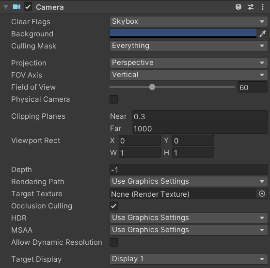
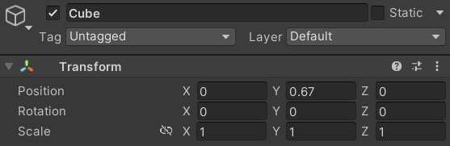

# Interfaces Inteligentes seminario 3

1. **Qué funciones se pueden usar en los scripts de Unity para llevar a cabo traslaciones, rotaciones y escalados.**

* Translaciones:
    * Translate
* Rotaciones:
    * LookAt
    * Rotate
    * RotateAround
* Escalados:
    * Usar propiedad localScale

2. **Como trasladarías la cámara 2 metros en cada uno de los ejes y luego la rotas 30º alrededor del eje Y?. Rota la cámara alrededor del eje Y 30ª y desplázala 2 metros en cada uno de los ejes. ¿Obtendrías el mismo resultado en ambos casos?. Justifica el resultado**

transform.Translate(2, 2, 2);
transform.Rotate(0, 30, 0);

No se obtiene el mismo resultado ya que translate usa los ejes locales del objeto, que cambian al realizar la rotación.

3. **Sitúa la esfera de radio 1 en el campo de visión de la cámara y configura un volumen de vista que la recorte parcialmente.**

4. **Sitúa la esfera de radio 1 en el campo de visión de la cámara y configura el volumen de vista para que la deje fuera de la vista.**

5. **Como puedes aumentar el ángulo de la cámara. Qué efecto tiene disminuir el ángulo de la cámara.**

 Aumentando el FOV (Field of View). Tiene efecto de zoom, haciendo que todo se vea más grande

6. **Es correcta la siguiente afirmación: Para realizar la proyección al espacio 2D, en el inspector de la cámara, cambiaremos el valor de projection, asignándole el valor de orthographic**

Sí.

7. **Especifica las rotaciones que se han indicado en los ejercicios previos con la utilidad quaternion.**

La rotación en Euler de (0, 30, 0) equivale a un cuaternión de (0.00000, 0.25882, 0.00000, 0.96593)

8. **¿Como puedes averiguar la matriz de proyección en perspectiva que se ha usado para proyectar la escena al último frame renderizado?.**

Usando Camera.projectionMatrix

9. **¿Como puedes averiguar la matriz de proyección en perspectiva ortográfica que se ha usado para proyectar la escena al último frame renderizado?.**

De la misma manera, con Camera.projectionMatrix

10. **¿Cómo puedes obtener la matriz de transformación entre el sistema de coordenadas local y el mundial?.**

Usando Transform.localToWorldMatrix

11. **Cómo puedes obtener la matriz para cambiar al sistema de referencia de vista**

Usando Camera.worldToCameraMatrix

12. **Especifica la matriz de la proyección usado en un instante de la ejecución del ejercicio 1 de la práctica 1.**

Tenemos a partir de estos parámetros de la cámara:



Usando el siguiente script:

```c#
    Camera camera = Camera.main; // Accede a la cámara principal
        Matrix4x4 projectionMatrix = camera.projectionMatrix; // Obtén la matriz de proyección
        Debug.Log(projectionMatrix); // Imprime la matriz en la consola para visualizarla
````

Obtenemos la matriz de proyección por consola:

```text
0.85086	0.00000	0.00000	0.00000
0.00000	1.73205	0.00000	0.00000
0.00000	0.00000	-1.00060	-0.60018
0.00000	0.00000	-1.00000	0.00000
```

13. **Especifica la matriz de modelo y vista de la escena del ejercicio 1 de la práctica 1.**

Dado nuestro cubo en esta posición:



su matriz de modelo sería:

```text
1 0 0 0
0 1 0 0.67
0 0 1 0
0 0 0 1
```

Por otro lado, la matriz de vista sería:

```text
0.85086	0.00000	0.00000	0.00000
0.00000	1.73205	0.00000	0.00000
0.00000	0.00000	-1.00060	-0.60018
0.00000	0.00000	-1.00000	0.00000
```

Esto se ha sacado a partir del siguiente script atribuido a la cámara:

```c#
    Camera camera = Camera.main;
    Matrix4x4 viewMatrix = camera.worldToCameraMatrix;
    Debug.Log(viewMatrix);
```

14.**Aplica una rotación en el start de uno de los objetos de la escena y muestra la matriz de cambio al sistema de referencias mundial.**

Obtenemos la matriz de cambio al sistema de referencias mundial del cubo al rotarlo 45 grados en el eje Y:
```text
0.70711	0.00000	0.70711	0.00000
0.00000	1.00000	0.00000	0.67000
-0.70711	0.00000	0.70711	0.00000
0.00000	0.00000	0.00000	1.00000
```

Con el siguiente script:

```c#
void Start()
    {
        // Se aplica una rotación de 45 grados en el eje Y
        transform.Rotate(0, 45, 0);

        Matrix4x4 worldMatrix = transform.localToWorldMatrix;

        Debug.Log("Matriz de cambio al sistema de referencias mundial:");
        Debug.Log(worldMatrix);
    }
```

15. **¿Como puedes calcular las coordenadas del sistema de referencia de un objeto con las siguientes propiedades del Transform:?: 
 Position (3, 1, 1), Rotation (45, 0, 45)**

Se puede hacer construyendo una matriz de transformación global a partir de las propiedades del objeto dadas por transform:

```c#
    transform.position = new Vector3(3, 1, 1);
    transform.rotation = Quaternion.Euler(45, 0, 45);

    Matrix4x4 worldMatrix = transform.localToWorldMatrix;

    Debug.Log("Matriz de transformación:");
    Debug.Log(matrix);
```

16. **Investiga sobre los modelo de iluminación que aplica Unity y resume las relaciones existentes con el modelo explicado en clase.**

Unity aplica diversos modelos de iluminación que se relacionan estrechamente con los conceptos explicados en clase. En primer lugar, utiliza la iluminación local, considerando los componentes ambiente, difuso y especular. Estos componentes simulan cómo la luz interactúa con las superficies de los objetos, tal como el modelo de iluminación local que vimos, donde la luz ambiente aporta una iluminación base, la luz difusa depende del ángulo entre la luz y la normal de la superficie, y la luz especular añade brillos según la posición del observador.

En cuanto a las técnicas de sombreado, Unity implementa métodos como Gouraud y Phong. Al igual que en clase, el sombreado Gouraud interpola colores entre vértices para suavizar la apariencia, mientras que el sombreado Phong interpola las normales y calcula la iluminación por píxel, ofreciendo resultados más realistas.

Además, Unity incorpora iluminación global, similar al concepto de radiosidad que estudiamos. Esto permite que los objetos no solo sean iluminados por fuentes directas, sino también por la luz reflejada en otros objetos de la escena, creando una iluminación más realista y coherente.

En cuanto a los materiales, Unity permite definir propiedades que afectan la reflexión de la luz, como los coeficientes de reflexión para cada tipo de luz.

Por último, el uso de texturas en Unity es fundamental para agregar detalle y realismo a los objetos. Al igual que vimos, las texturas se mapean sobre las superficies y pueden influir en las propiedades de iluminación, como en el caso de los mapas de normales o especulares

17. **Indica las funciones de la API de Unity más importantes respecto a la iluminación**

Light: Clase principal para crear y configurar luces.

`Light.type`: Define el tipo de luz (Directional, Point, Spot, etc.).

`Light.color`: Establece el color de la luz.

`Light.intensity`: Controla la intensidad o brillo de la luz.

`Light.range`: Determina el alcance de una luz puntual o spot.

`Light.spotAngle`: Especifica el ángulo del cono en luces tipo spot.

`Light.shadows`: Configura el tipo de sombras que proyecta la luz.

`RenderSettings.ambientLight`: Ajusta el color de la luz ambiental de la escena.

`RenderSettings.skybox`: Define el material del cielo para efectos de iluminación global.

`Shader`: Clase utilizada para crear y modificar shaders que determinan cómo se renderiza la luz en los materiales.

`DynamicGI.UpdateEnvironment()`: Actualiza la iluminación global en tiempo de ejecución.
